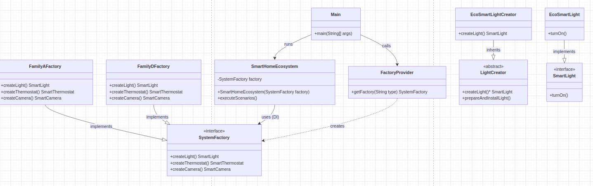

# Smart Home Ecosystem - Design Patterns Assignment

## Overview
This project implements a comprehensive **Smart Home Ecosystem** demonstrating the practical application of enterprise design patterns in Java (Maven project).

## Implemented Design Patterns
1. **Abstract Factory**: Manages families of related smart home products (`SmartLight`, `SmartThermostat`, `SmartCamera`) ensuring architectural compatibility.
2. **Factory Method**: Encapsulates object creation logic inside creator subclasses (`LightCreator` -> `EcoSmartLightCreator`).
3. **Runtime Factory Selection**: Dynamic factory instantiation via `FactoryProvider` based on configuration strings.

## Product Families
* **Family A**: EcoSmart (Energy-efficient line)
* **Family B**: NexusPro (High-performance line)
* **Family C**: TitanIndustrial (Heavy-duty line)
* **Family D**: ZenithSmart (Advanced AI line - added with zero modification to core business logic, adhering to OCP)

## UML Class Diagram

## Running Automated Tests
To run all 15 automated unit tests via Maven, execute:
```bash
mvn test
